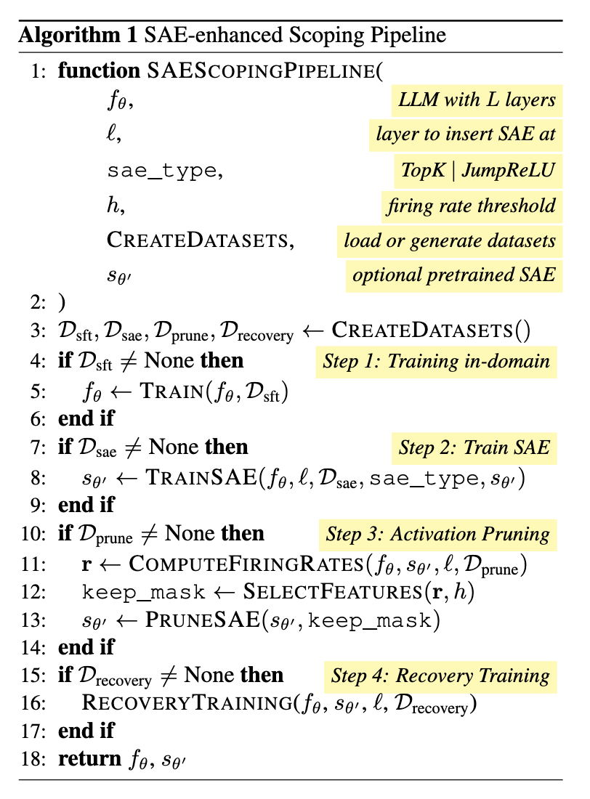
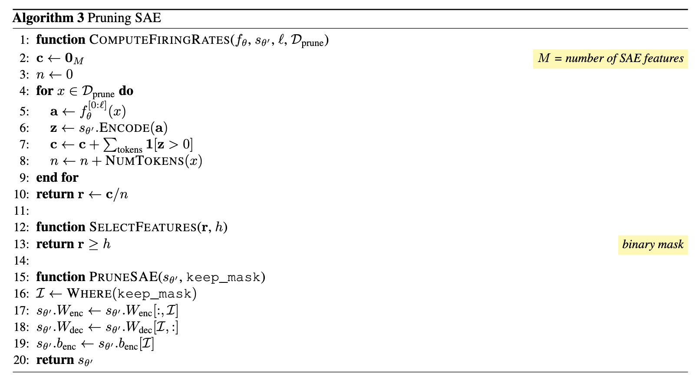
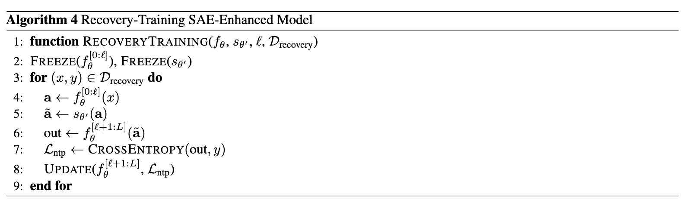
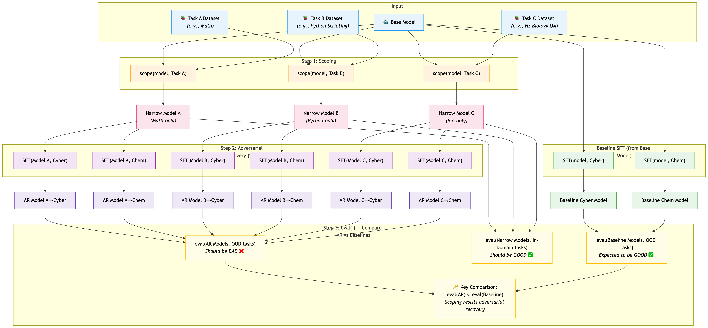

# Model Scoping Mini-project

## Installation

```bash
git clone <your-fork-url>
cd SAEScopingMiniproject
pip install -e .          # core dependencies
```

---

The point of this repository is to give you a initial task for model scoping. By this README and following the instructions therein you:
- Will understand what is model scoping an why we care
- Will do work indicative of what you'll do in the UROP.
- May produce one new output for the paper.

You do not _need_ to finish everything, but the more you finish, the better. The minimum requirements should take 2-8 hours using AI assistance and cost at most $3/hr on Runpod or equivalent compute providers.

## What is "Model Scoping"
The goal of model scoping is to take a general-purpose model and make it good on only one domain. Ideally, it should be as good as the original model in-domain and as maximally bad out-of-domain. We especially care about making the model bad on dual-use or malicious out-of-domain tasks, like cybersecurity, chemical knowledge, coding, virology, design and manufacturing of explosives, etc... Because in practice our scoping method involves training the model in-domain (so it's good to begin with) we often compare with a finetuned version instead of the original model if that boosts performance. Whether this is necessary depends on the model's original capability.

Here you will do the following (with access to any and all tools you need, including Claude Code and AI help):
- Refactor a repository and make sure that it works
- Define a specific experiment based on "Experimental Setup" section below
- Understand why we are doing this
- Reproduce prior work

It may be a bit rough around the edges so I will be available, albeit in London time.

## High level algorithm
The high level algorithm is fairly simple and explained by the diagrams in this seciton. TLDR is that we use Sparse Auoencoders (SAEs; https://arxiv.org/abs/2309.08600) a method to determine features relevant to a task. We force an LLM to use these SAEs. The SAE is pruned to retain only task-specific neurons and the LLM has the layers _after_ the SAE trained to recover performance if needed. For this task you will be working only with a variant where we use pretrained SAEs (Gemmascope) for Gemma-2. We then prune the Gemmascope SAE and train the LLM.

_PS: we train the layers AFTER because otherwise it's posible that OOD features could rotate onto the retained SAE neuron feature directions in the encoding matrix._

### Orchestration: our overall algorithm


#### Pruning: we select the most frequently-firing neurons


#### Recovery: we train the layers AFTER the SAE


## Experimental Setup
On some basic level the experimental setup is simple:
1. We take an original model (i.e. in this case `gemma-2-9b-it` from GDM) and turn it into a model that "only does `X` for some X (i.e. math, biology QA, etc...). We may repeat this for multiple values of `X` (i.e. multiple tasks). **NOTE:** this is algorithm 2 from above.
2. We a set of OOD tasks `{Y, Z, ...}` that we will try to elicit from the model. We take the model from (1) and try to make it better at these tasks either by finetuning (SFT) or prompt optimization (or some other method). At the end we try to show that for each resulting model, the performance (respectively) on `Y`, `Z`, etc... is worse than the original model. In other words: it was not possible to make the "only-`X`" (scoped) model good on any of the OOD tasks. The pre-elicitation scoped model should also be shown to be bad OOD.
3. For each of the tasks from (2) we compare to a baseline. The baseline could also produce an "only-`X`" (scoped) model, or it could produce a "no-Y" and "no-Z" etc... model (unlearning is an example of the latter). We want to show that we do at least a well as the baselines in-domain and at most as good OOD.

The diagram below hopefully makes it clear. Each `blue->orange->red` path corresponds to trying one task in (1). Each `purple` path corresponds to the elicitation from (2).



## Motivation
I think a reasonable analogy between humans and AI is that both humans and AI can be either capable or not capable of doing certain tasks, and somewhat seperately they can choose to or not to those tasks. For example, an LLM could know a lot of harmful information but choose not to disclose it unless it's jailbroken. We don't explore the theory of mind philosophical questions this begs since our contribution is technical, but conceptually it's useful to understand the landscape of AI security/safety defenses.

The defenses that exist right now either tend to lie more on one of the two extremes of either "make the AI not want to do it" or (2) "make an AI not be able to do it." For example, you could remove data from pretraining or unlearn it (both case 2) or you could apply refusal training, moderation classifiers, steering, or prompt-based dynamic guidance (all case 1). Our work is case 2, because it reduces the liability of jailbreaking.

The issue with case 2 today is that interventions at train-time are expensive, but alternatives like unlearning are empirically ineffective. This is due to a few reasons:
- A: You need experts to make effective classifiers and unlearning datasets for niche tasks like virology
- B: You need to cover many topics
- C: The influence of data on model behavior is an unsolved problem
- D: The data you need for unlearning CBRN could be toxic

We therefore try to slot in a solution that has the following properties:
- Do not use malicious data (solve A and D)
- Only use in-domain data (solve B and D)
- Do it during post-training (avoid C)

The result is "model scoping": the idea to make a model that "only does `X`". Moreover, we only post-train using data from `X` and not other tasks.

## Tasks
The goal is to go through one short end-to-end experiment. You may not get around to baseline, but ideally you should try some simple one. You should choose a task and create an only-that-task model. Then you should take this scoped model and try to elicit OOD capabilities for a couple OOD tasks. Then, you will want to analyze whether the result suggests succesful scoping.

I propose that you follow this plan:
1. **Create a fork** to develop your own implementation in and get access to compute.
2. **Refactor code and get it working**
3. **Find/pick a dataset** to use as your in-domain dataset. I encourage you to use anything from https://huggingface.co/datasets/4gate/StemQAMixture such that it is NOT biology but if you prefer biology that is fine too. The tradeoff is that if and only if you pick biology then you will duplicate my work. Duplication means that I can verify your correctness and be more helpful, but it means that you won't get additional work "for free" (if you were to do another topic, if you get good performance, we might be able to put it directly into the paper as part of a larger experiment). It's critical to have a train/test split. You may or may not choose to use the same data for calculating the firing rates, but if you do, you will need to argue that it is OK. If you believe it is not OK please tell me why.
4. **Calculate the firing rates** on (part of) the train set. Be able to find firing rates of SAE features and plot them.
5. **Evaluate the performance of the SAE-hooked model**, varying the number of neuron that you keep in the SAE when sorted by relevance to the input. I recommend using the firing rates for this (for example, if you keep the top `K` most relevant neurons, that would correspond to keeping the `K` with the highest firing rate).
6. **Train the underlying LLM to perform well-in domain** on the lowest reasonable number of neurons (from 5) possible. Justify your choice in the terms of the downstream goal---to satifice the joint conditions of being good in-domain and bad OOD (improving SoTA at this).
7. **Evaluate the performance of the finetuned SAE-hooked model** in domain and OOD on at least 2 salient OOD tasks. Choose them and justify why we care and what they showcase. Try to control for confounders and make the strongest possible argument.
8. **[Bonus] Implement a baseline.** It can be one of (feel free to use any and all prior code so long as you can validate that it properly works):
    - **Pruning  baseline:** one of https://arxiv.org/abs/2505.15811, https://proceedings.neurips.cc/paper/1992/file/303ed4c69846ab36c2904d3ba8573050-Paper.pdf, https://proceedings.neurips.cc/paper/1989/hash/6c9882bbac1c7093bd25041881277658-Abstract.html. Other options include uing patching or attribution patching (https://www.neelnanda.io/mechanistic-interpretability/attribution-patching) to decide which weight to remove in such a way that you kee in-domain performance high. You may broadly do anything here so long as it is SoTA.
    - **Unlearning baseline:** you may find any unlearning (or related) method that is SoTA. For example, this could include descendant of RepE or Circuit breakers. You will need to be able to argue that your choice is SoTA.
9. **[Bonus] Credibly argue that your basline is SoTA** and explain why you chose it and why beating this baseline means that we are improving on SoTA for our task as outlined before. (_PS: model scoping has not really been explored before, so you want to be able to argue in terms of downstream consequence or you will want to describe why this is likely sufficient or at least the most informative choice to make a strong argument._)
10. **Write up your result** and argument in an Overleaf and hare with me (you could also share PDF+Tex source if you prefer). You must include the following:
    - The key finding: how well did your scoped model perform? Why did it perform well or not (as far as you can tell)? What did you vary (if anything at all)? How does the performance vary by OOD dataset, hyperparameters, or anything else?
    - Why is your baseline (if you added one) informative?
    - What have we learned?
11. **[Bonus] Add an additional experiment, ideally with Gemma3.** You may add an additional experiment of your choice. I recommend trying to make the code support Gemma3 with Gemmascope2 (https://deepmind.google/blog/gemma-scope-2-helping-the-ai-safety-community-deepen-understanding-of-complex-language-model-behavior).

For the writeup make sure to keep it under 2 pages with the prioritized information at the front. You can have an infinitely long appendix.

## Final product
At the end what you should have produced the writeup and any code that you changed in this repository (very high likelihood you will change a lot of code). You hould make your code/results fully reproduceable and have at least an integration test and sanity checks that your code runs properly documented so I can make sure your work works.
